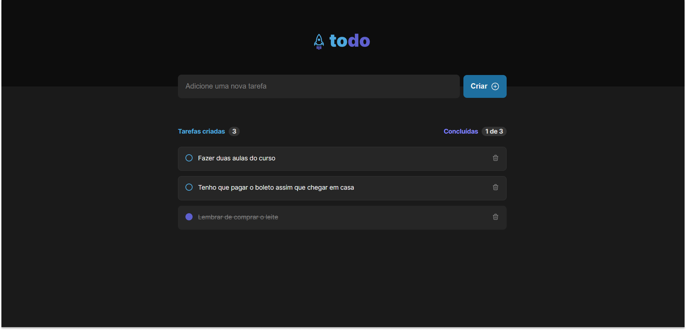

# Todo Improved

A Improved version of a tradicional ToDo App, made with React and Typescript



## Getting Started

These instructions will get you a copy of the project up and running on your local machine for development and testing purposes. See deployment for notes on how to deploy the project on a live system.

### Prerequisites

What things you need to install the software and how to install them

```
node.js > v16.15.1
```

### Running

A step by step series of examples that tell you how to get a development env running

Say what the step will be

```
npm run dev
```

This will open a windown to preview the project on the adress **http://localhost:3000/**

## Built With

- [Vite](https://vitejs.dev/) - To create the project
- [React](https://reactjs.org/) - The web framework used
- [Typescript](https://rometools.github.io/rome/) - JavaScript Superset
- [Styled Components](https://maven.apache.org/) - For styling
